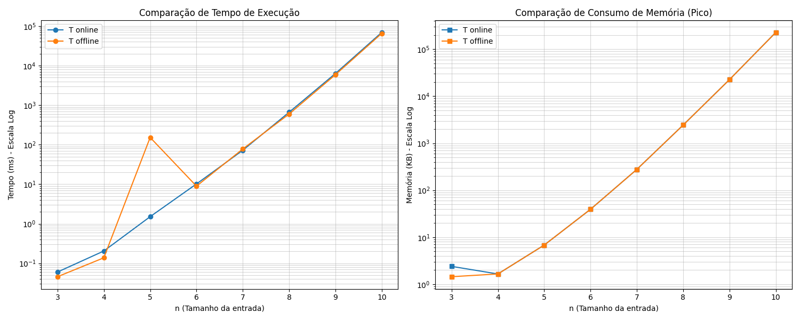

# SJT Permutation Algorithms - CT-208 (2026)

This repository contains the implementation and performance analysis of permutation generation algorithms based on the **Steinhaus-Johnson-Trotter (SJT)** logic. This project was developed as a requirement for the **CT-208** course in the Doctoral Program at the **Instituto Tecnológico de Aeronáutica (ITA)**, Brazil, taught by **Prof. Luiz Mirosola** in 2026.

## Authors
* **Flávio Souza** – Doctoral Student (ITA)
* **Nilson Sangy** – Doctoral Student (ITA)

## Overview

The primary goal of this project is to compare different strategies for generating all $n!$ permutations of a set using adjacent transpositions (Plain Changes). A system of computational analyses was developed to evaluate the efficiency of each approach.

## Implemented Algorithms

* **Algorithm P**: A standard real-time implementation of the SJT algorithm that finds the largest mobile element and performs a swap in each iteration.
* **Algorithm T (Online/Offline)**: 
    * **Online**: Generates permutations in real time, executing all search and logic reversal at each step, while recording them as "transactions" (swap indices).
    * **Offline**: Focuses on optimized execution through a pre-computed **Transition Table**. In this mode, permutation generation involves $O(1)$ complexity per step, eliminating searches and comparisons by only following previously recorded indices.

## Test & Analysis Methodology: 

To ensure the validity of the experimental data, the main script executes: 
1. **Cleanup:** Garbage collection (gc.collect()) between runs to avoid memory residue from previous tests. 
2. **Isolation:** Resetting the memory tracer (tracemalloc) for each value of $n$. 
3. **Standardization:** Using the same input vector (randomly shuffled) for all algorithms in a given $n$.

For rigorous analysis according to academic guidelines, assignments ($A$) are divided into:
* **$A$ (local vars)**: Assignments to control variables and search logic (e.g., `mobile`, `prox_idx`).
* **$A$ (to/from V)**: Assignments that directly manipulate the permutation and mechanics vectors (`a` and `d`).
* **Comparisons**: Logical tests to find moving elements and boundary limits.
* **Swaps**: Physical movements of elements in the vector.
* **Memory (KB)**: Peak amount of RAM allocated during execution.
* **Time (ms)**: Total execution time in milliseconds.

## Performance Analysis

 



The project evaluates the "viability range" for precomputing sequences:
* **Small $n$ ($n \le 11$)**: Precomputing the transition table is highly efficient as it eliminates the $O(n)$ search for the mobile element during execution.
* **Large $n$ ($n \ge 12$)**: Algorithm P is preferred due to memory constraints, as the transition table size grows factorially ($n!$).

## 📊 Algorithm: T Online

| n  | n!       | Comparações | Atribuições (local vars) | Atribuições (to/from V) | Trocas  | Memória (KB) | Tempo (ms) |
|----|----------|-------------|---------------------------|--------------------------|---------|--------------|-------------|
| 3  | 6        | 88          | 47                        | 32                       | 5       | 2.40         | 0.0602      |
| 4  | 24       | 494         | 229                       | 129                      | 23      | 1.65         | 0.2046      |
| 5  | 120      | 3151        | 1317                      | 634                      | 119     | 6.81         | 1.5124      |
| 6  | 720      | 22914       | 8887                      | 3755                     | 719     | 39.34        | 10.1741     |
| 7  | 5040     | 188273      | 68669                     | 26076                    | 5039    | 277.71       | 72.3029     |
| 8  | 40320    | 1728712     | 600595                    | 207517                   | 40319   | 2438.98      | 661.8379    |
| 9  | 362880   | 17559351    | 5847583                   | 1860638                  | 362879  | 22594.34     | 6330.6767   |
| 10 | 3628800  | 195592310   | 62887219                  | 18553119                 | 3628799 | 228483.66    | 69299.7360  |

---

## 📊 Algorithm: T Offline

| n  | n!       | Comparações | Atribuições (local vars) | Atribuições (to/from V) | Trocas  | Memória (KB) | Tempo (ms) |
|----|----------|-------------|---------------------------|--------------------------|---------|--------------|-------------|
| 3  | 6        | 75          | 53                        | 45                       | 10      | 1.45         | 0.0458      |
| 4  | 24       | 416         | 253                       | 179                      | 46      | 1.65         | 0.1378      |
| 5  | 120      | 2635        | 1437                      | 877                      | 238     | 6.81         | 152.4225    |
| 6  | 720      | 19074       | 9607                      | 5199                     | 1438    | 39.34        | 8.9450      |
| 7  | 5040     | 156233      | 73709                     | 36161                    | 10078   | 277.71       | 77.9957     |
| 8  | 40320    | 1431352     | 640915                    | 288163                   | 80638   | 2438.98      | 597.1932    |
| 9  | 362880   | 14515191    | 6210463                   | 2586405                  | 725758  | 22594.34     | 5900.3488   |
| 10 | 3628800  | 161481590   | 66516019                  | 25810727                 | 7257598 | 228483.66    | 65336.1439  |

## Project Structure

* `main.py`: Entry point for running experiments and generating graphs.
* `p.py`: Instrumented implementation of Algorithm P.
* `t.py`: Instrumented implementations of Algorithm T (Online and Offline).
* `tracker.py`: `AlgorithmTracker` class for monitoring metrics.

## Dependencies

The project is written in **Python 3.10+** and requires the following libraries for data analysis and visualization:
* `matplotlib`: For plotting complexity curves.
* `pandas`: For organizing metric tables.
* `math`: For factorial calculations.

## Usage

1.  **Install dependencies**:
    ```bash
    pip install matplotlib pandas
    ```

2.  **Run the analysis**:
    ```bash
    python src/main.py
    ```

The script will output a table in the terminal comparing **Comparisons**, **Attributions**, and **Exchanges** for both algorithms across values of $n$ ranging from 2 to 10. A logarithmic plot will also be generated to visualize the factorial growth of the operations.